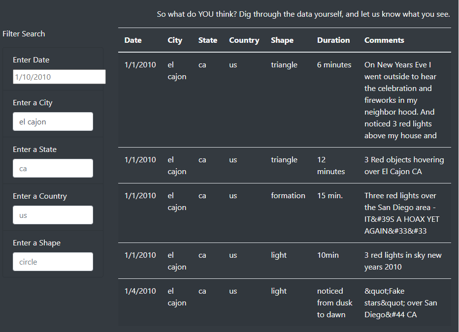

# UFOs

---

### Overview of Project

The purpose of this project was to display UFO sightings for Dana. She has a file with information about sightings but needed a way to display this data and make it easier for a web user to filter the data to find the information that they are looking for. 

---

### Results

To perform a search, the user will enter the filter criteria they are wanting to search by in the Filter Search options on the left hand side of the table. The example provided shows that the city El Cajon was entered in the City filter box. This resulted in showing only the sightings that were in El Cajon.

---

### Summary

One drawback of the webpage is that it does not provide a clear opinion from the Ufologists on if the sighting was Fact or Fantasy. An enhancment that would help support this would be to add a column on the table to display the Ufologists' opinion about if it was fact or fantasy. Another enhancment that is needed is to review the coding done for the comments data. There seems to be additional code that is not translated into text. A final enhancment that would be helpfull would be a search button. By doing this it would allow the user to enter multipe criteria and then have the output narrowed down to the multi search criteria.

